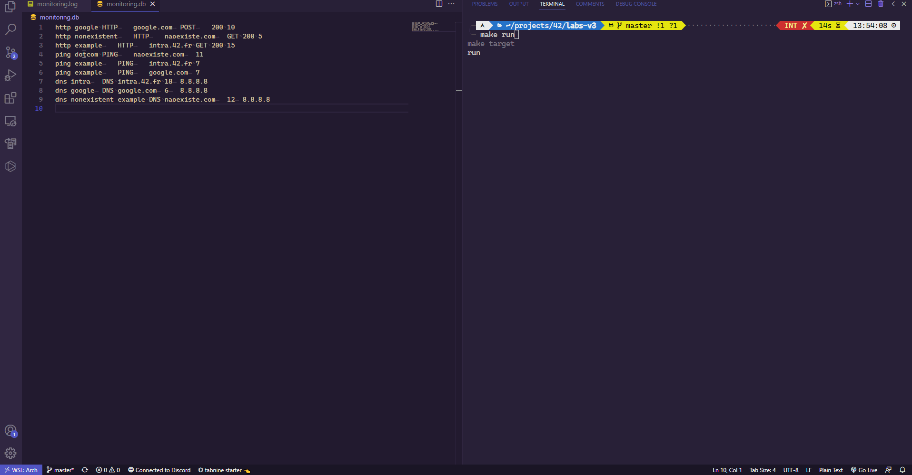
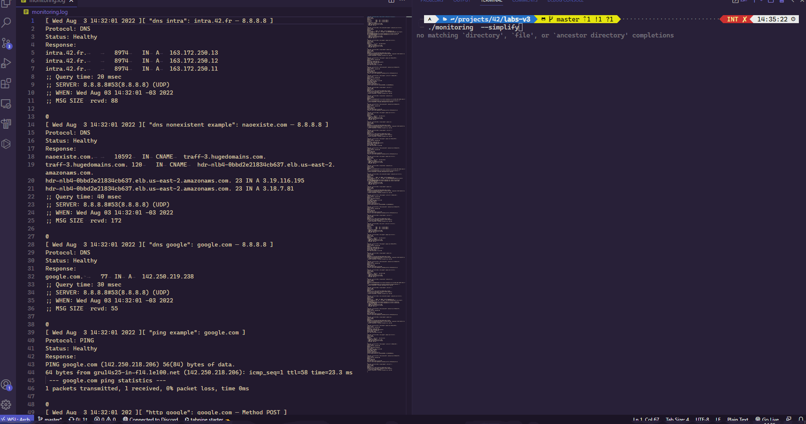

# 42 Labs 3ª Edição — Monitoring

## Sumário
- [Funcionamento](#funcionamento)
- [Tecnologias utilizadas](#tecnologias-utilizadas)
- [Utilização](#utilização)
- [Considerações finais](#considerações-finais)

Nesse desafio, tivemos que desenvolver uma aplicação para monitoramento de serviços web, com base em [instruções específicas](./assets/INSTRUCTIONS.md).



## Funcionamento

O programa `monitoring` depende apenas de um arquivo de configurações, entitulado `monitoring.db`. Dentro desse arquivo, devem conter as informações necessárias sobre o serviço a ser monitorado e como o usuário espera que esse serviço responda. São permitidos 3 protocolos diferentes: HTTP, PING e DNS.

As configurações para cada protocolo são:

| Protocolo   | Configurações                                                           |
|-------------|-------------------------------------------------------------------------|
| HTTP        | nome, protocolo, endereço, método HTTP, código HTTP esperado, intervalo |
| PING        | nome, protocolo, endereço, intervalo                                    |
| DNS         | nome, protocolo, endereço, intervalo, servidor DNS                      |

Abaixo, exemplo do arquivo descrito acima:

```txt
# monitoring.db

intra	HTTP	intra.42.fr	GET	200	120
game ping test	PING	game.42sp.org.br	60
workspaces monitoring	PING	workspaces.42sp.org.br	60
```

Caso alguma informação não seja informada ou seja informada de maneira incorreta (como por exemplo um método HTTP inexistente), o programa é encerrado e um erro é exibido no terminal do usuário. Novas linhas vazias e linhas iniciadas com `#` são desconsideradas durante a execução do programa.

### monitoring

Como demonstrado mais acima, o programa vai realizar as operações descritas no arquivo `monitoring.db` e tratar as respostas obtidas de duas maneiras. Primeiramente, o programa vai exibir as informações de forma básica e concisa no terminal do usuário, destacadas pelo horário em que a requisição foi feita e pelo nome do serviço, indicado no arquivo de configuração. Logo em seguida, o mesmo registro de atividades será armazenado num arquivo de log, denominado `monitoring.log`, que deve conter as mesmas informações exibidas no terminal, apenas de forma mais detalhada.

### simplify



Outra funcionalidade do programa de monitoramento é a opção `--simplify`. Quando executado com essa opção, o programa deve ler o arquivo de log e exibir no terminal as informações presentes dele, porém de forma básica e concisa, como seria se executássemos o programa normalmente. Note que, a flag `--simplify` não executa o programa novamente, apenas formata as informações do log. Isto é, caso o arquivo de log esteja vazio, o programa é encerrado naturalmente.

### Healthy or Unhealthy?

- Protocolo HTTP
	- No caso do protocolo HTTP, o arquivo de `monitoring.db` deve receber um código HTTP, que é o código esperado pelo usuário. O programa irá fazer uma requisição com base no método informado pela configuração e comparar o código retornado com o código esperado. Se houver diferença entre os dois códigos, o serviço não está saudável.

- Protocolo PING
	- O PING é bem simples, só é necessário verificar se o serviço está ativo, e essa verificação é feita enviando um pacote de dados para o servidor. Caso o servidor não receba o pacote, o serviço não está saudável.

- Protocolo DNS
	- Para o DNS, devemos tentar resolver o domínio recebido por meio de um servidor DNS. A verificação da saúde do serviço também é simples: se o domínio não pôde ser resolvido, significa que não aponta pra lugar nenhum, então não está saudável.

## Tecnologias utilizadas

- O programa foi feito inteiramente em C.
- O funcionamento do programa é baseado em multiprocessamento, executando comandos do sistema:
	- Para o protocolo HTTP, é utilizado o `curl`;
	- Para o protocolo PING, é utilizado o `ping`;
	- Para o protocolo DNS, é utilizado o `dig`.
- O ambiente de desenvolvimento utilizado foi Visual Studio Code com WSL;
- Testes foram feitos utilizando bash scripting;
- O controle de versionamento foi feito via git, pela plataforma do GitHub.

## Utilização

### Dependências

Como o projeto funciona com base em utilitários do sistema, é necessário a instalação de alguns deles, caso já não os tenha:
- Ubuntu
```sh
sudo apt update
sudo apt install curl iputils dnsutils
```

- Arch
```sh
sudo pacman -Sy curl iputils dnsutils
```

### Instalação

- Primeiramente, clone o repositório;
```sh
git clone https://github.com/42sp/42labs-selection-process-v3-araggohnxd.git monitoring
```

- Entre no diretório clonado;
```sh
cd monitoring
```

- Compile o projeto por meio do Makefile;
```sh
make
```

- As regras disponíveis no Makefile são:
	- `all` compila o projeto (padrão);
	- `run` compila o projeto e o executa;
	- `simple` compila o projeto e o executa com a flag `--simplify`;
	- `vg` compila o projeto e o executa com `valgrind`;
	- `test` compila o projeto e executa os testes disponíveis;
	- `clean` deleta os objetos criados na compilação;
	- `fclean` deleta o arquivo do binário executável;
	- `re` deleta os objetos, o binário executável e re-compila o projeto.

- Crie um arquivo `monitoring.db` na raiz do diretório (mesmo diretório do executável) de acordo com a formatação correta;
- Execute o binário, com ou sem a flag `--simplify`;
```sh
./monitoring
```

- Aproveite!

## Considerações finais

A experiência de participar do processo seletivo do Labs foi enriquecedora, porém não pude deixar de sentir que existem pontos de melhora que poderiam ser explorados com um prazo maior.

Eu gostaria de ter feito mais testes, foi a primeira vez que eu de fato fiz testes automatizados e estudei um pouco mais sobre bash scripting, e é uma ferramenta muitíssimo útil que pretendo utilizar com mais frequência no futuro.

O processo de criação desse README.md também foi algo novo, não costumo fazer isso e, fazendo, notei a importância da existência desse tipo de registro/documentação.

No lado mais técnico, o Labs foi meu primeiro contato com redes de forma geral. Foi a primeira vez que tive que trabalhar com requisições e protocolos, resolver domíniios, me comunicar com os serviços de forma manual, e certamente foi um grande desafio. Certamente o projeto está longe de estar perfeito, principalmente pelo fato de que eu não fui capaz de utilizar uma única ferramenta que unificasse a execução de todos os protocolos. Usar diferentes utilitários para diferentes protocolos me fez ter muito trabalho com o parsing dos comandos, o que tomou praticamente 90% do meu tempo durante a realização do projeto. Talvez, com mais tempo, eu tivesse conseguido estudar uma ferramenta como `libcurl` ou `mongoose`, que atendesse minhas necessidades tudo num único ecossistema. Quem sabe na próxima.

De qualquer forma, estou feliz com o resultado. Reconheço que há muito o que melhorar, mas pra quem nunca teve experiência com os conceitos exercitados no projeto, o fato de simplesmente ter conseguido entregar algo já me deixa contente, pois confesso que no início as expectativas não iam tão longe assim. Foi um grande aprendizado, e espero ter mais oportunidades como essa no futuro, mas com a perspectiva que passei a ter após ter participado do processo.
